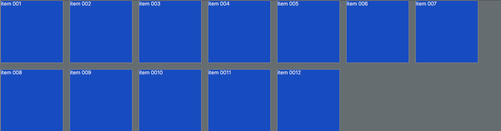
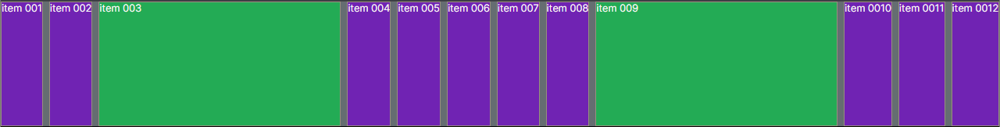

# BASE STUDIES

## Display Flex

* base código tsx:
"use client";

import React from "react";
import { Container } from "./CardStyles";

const FlexBoxTutorial: React.FC<{}> =() => {
   return (
    <Container>
      
item 001

      
item 002

      
item 003

      
item 004

    </Container>    
   )
};

export default FlexBoxTutorial;
-------------------------------
* Styled components:
"use client";

import styled from "styled-components";

export const Container = styled.div`
  display: flex;
  background-color: #898989;

  div {
    flex: 1;
    margin: 10px;
    border: 1px solid black;
    padding: 20px;
    text-align: center;  
    background-color: #1b933f;
  }
  
----------------------------------
# COMPONENTE PAI (PARENT COMPONENT)

## display: flex;

$$$$$$$$$$$$$$$$$$$$$$$$$$$$$$$$$$$$$$$$$$$$

## flex-direction: column;
export const Container = styled.div`
  display: flex;
  gap: 10px;
  background-color: #898989;
  height: 900px;
  flex-direction: column;

  div {
    display: flex;  
    border: 1px solid black;
    padding: 50px;
    text-align: center;  
    background-color: #1b933f;   
    width: 200px;
    height: 200px;
  }  
`;

----------------------------------
## result: flex direction column

----------------------------------
## flex-direction: column-reverse;

----------------------------------
## flex-direction: row-reverse;

----------------------------------
##  flex-direction: row;

----------------------------------
## flex-wrap: wrap;

----------------------------------
## flex-wrap: wrap-reverse;

----------------------------------
## flex-flow: column wrap;

$$$$$$$$$$$$$$$$$$$$$$$$$$$$$$$$$$$$$$$$$$$$

## justify-content o justify-content: flex-start não tem mudanças é o padrão:

## justify-content: flex-start;

----------------------------------
## justify-content: flex-end;

----------------------------------
## justify-content: center;

----------------------------------
## justify-content: space-between;

----------------------------------
## justify-content: space-around;

----------------------------------
## justify-content: space-evenly;

$$$$$$$$$$$$$$$$$$$$$$$$$$$$$$$$$$$$$$$$$$$$

## align-items

## justify-content: center / align-items: center;

----------------------------------
## justify-content: center / align-items: start 

----------------------------------
## justify-content: center / align-items: end

$$$$$$$$$$$$$$$$$$$$$$$$$$$$$$$$$$$$$$$$$$$$

## gap

## gap: 20px linha; padrão

----------------------------------
##  gap: 10px linha 40px coluna;

----------------------------------
## gap: 50px linha 10px coluna;

----------------------------------
## row-gap: 30px;

----------------------------------
## column-gap: 30px;

----------------------------------

###################################################

# COMPONENTE FILHO (CHILDREN COMPONENT)

* quando estiliza somente o componente filho através de id por exemplo:

<Container>
       
item 001

       
item 002

       
item 003

       
item 004
   
       
item 005

       
item 006

       
item 007

       
item 008
  
       
item 009

       
item 0010

       
item 0011

       
item 0012
    
     </Container>

export const Container = styled.div`
  display: flex; 
  gap: 10px;
  background-color: #898989;  
  flex-wrap: wrap;   
  align-items: center; 

  div {    
    border: 1px solid black;      
    background-color: #7e22ce; 
    width: 200px;
    height: 200px;
  }  

  #id-1 {
    flex-grow: 1;
    background-color: #22c55e;
  }
`;
  
## flex-grow: 1 - item 003; vai cobrir todo espaço disponível na sua linha

----------------------------------
## flex-grow: 1 - item 003 e 009; vai cobrir todo espaço disponível na sua linha

----------------------------------
## flex-grow: 1 - item 003 e 009; sem width / vai cobrir todo espaço disponível na sua linha sem a width "largura do componente"

----------------------------------
## flex-shrink: 2 - item 003; diminuir a metade dos outros itens proporciaonal.

----------------------------------
## flex-basis: 20px; tamanho específico para um componente filho

----------------------------------
## flex: 2 2 30px; reune os 3 tipos: flex-grow, flex-shrink, flex-basis

----------------------------------
## align-self: center; alinha apenas um componente especifico/ basicamente utiliza o mesmo que no align-components

----------------------------------
## align-self: flex-end;

----------------------------------
## order: 2; todos tem ordem um e o elemento 003 tem ordem 2 por isso foir pora o final.

----------------------------------
## order: 2; item 003 e order: 1; item 009 / todos tem ordem 0 o item 009 tem order 1 e o 003 tem order 2

----------------------------------
## order: -1; para colocar em primeiro na ordem tem que colocar -1 pois começa com 0.

